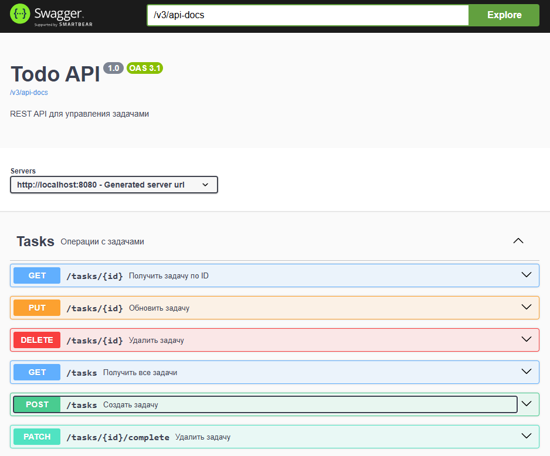

# Todo API

REST API application for task management built with Spring Boot.

## Technologies

- Java 17
- Spring Boot 3
- Spring Data JPA
- PostgreSQL
- REST API
- Swagger/OpenAPI
- JUnit 5
- Mockito
- REST Assured
- Maven
- Lombok
- MapStruct


## Features

- Create tasks
- Get all tasks
- Get task by ID
- Update tasks
- Delete tasks
- Validation of incoming requests
- PostgreSQL database integration
- API documentation with Swagger


## Project Structure

```
src/main/java/org/example/todo_api

├── controller
├── service
├── repository
├── entity
├── dto
├── mapper
└── exception
```


## API Endpoints

### Create Task

POST

```
/tasks
```

Request:

```json
{
  "title": "Learn Spring",
  "description": "Practice CRUD"
}
```

Response:

```json
{
  "id": 1,
  "title": "Learn Spring",
  "description": "Practice CRUD",
  "completed": false
}
```


### Get All Tasks

GET

```
/tasks
```


### Get Task By ID

GET

```
/tasks/{id}
```


### Update Task

PUT

```
/tasks/{id}
```

Request:

```json
{
  "title": "Updated task",
  "description": "Updated description"
}
```


### Delete Task

DELETE

```
/tasks/{id}
```


## Swagger Documentation

Swagger UI:

```
http://localhost:8080/swagger-ui/index.html
```


## Database Configuration

Application uses PostgreSQL.

Example configuration:

```properties
spring.datasource.url=jdbc:postgresql://localhost:5432/todo_db
spring.datasource.username=postgres
spring.datasource.password=password

spring.jpa.hibernate.ddl-auto=update
```


## Running the Application

Clone repository:

```bash
git clone https://github.com/your_username/todo-api.git
```

Go to project folder:

```bash
cd todo-api
```

Run application:

```bash
mvn spring-boot:run
```

Application starts on:

```
http://localhost:8080
```


## Testing

Run tests:

```bash
mvn test
```

Implemented tests:

- Service layer tests using JUnit 5 and Mockito
- API tests using REST Assured
- CRUD scenario validation
- Positive and negative test cases

## Swagger Preview




## Author

Vlad Smirnov

Junior Java Developer